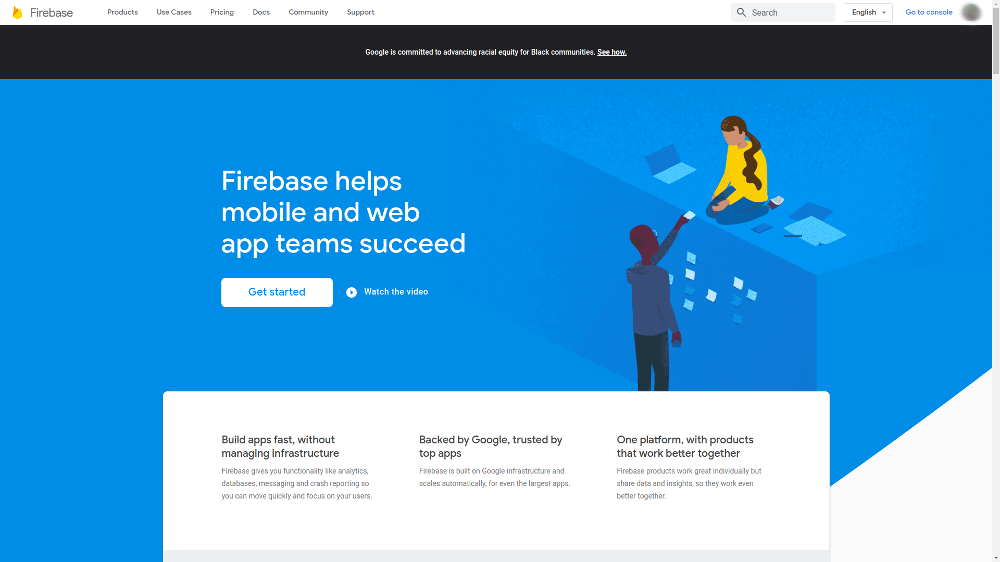
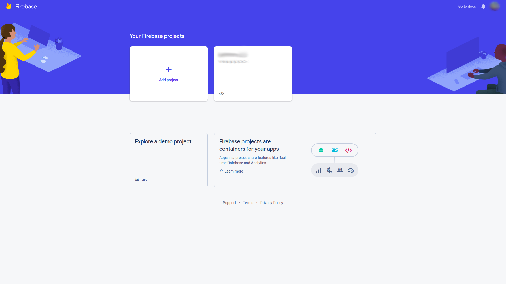
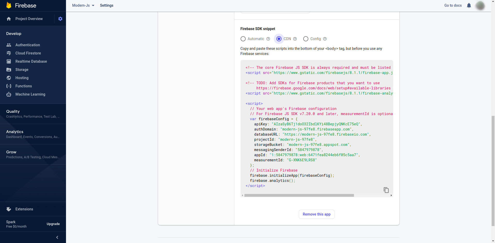
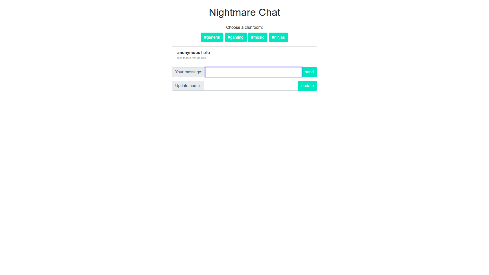
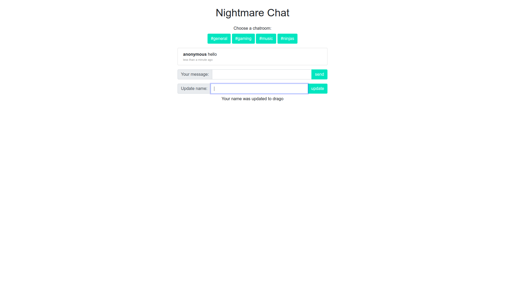
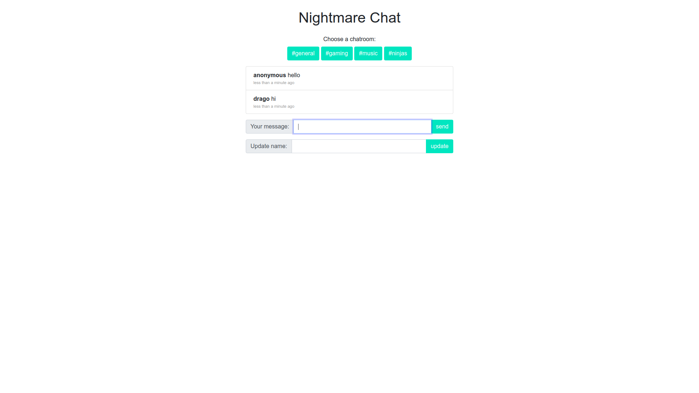
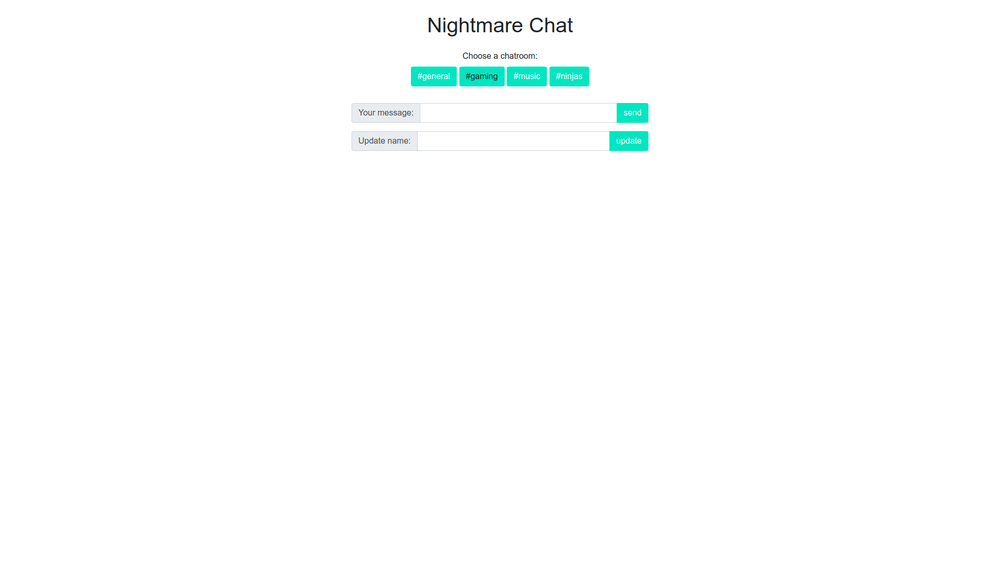

# NightmareChat

Summary
---
Basic chat app with multiple chat rooms.

Setup
---
To run this repo you will need an api key and a few firebase and firestore scripts.  
It's fairly easy to get your hands on them.  

Go to the [firebase](https://firebase.google.com/) site and register.

Once you've logged in, click on ___Go to console___ on the top right beside your profile picture.

  

Add new project  

To get the scripts that you have to add to the program, go to Project Overview -> Click on your app name (below project name) -> Settings.  
Within the *General* tab in Settings, go down to _Your Apps_ and copy the scripts in CDN. Paste them at the end of the body tag.  

Preview
---
Once you run the app your default username is _anonymous_.  

Change your name using the _update username_ field.

The new username will now be used.

Once you change the room, no other room's chat will be visible to you.

